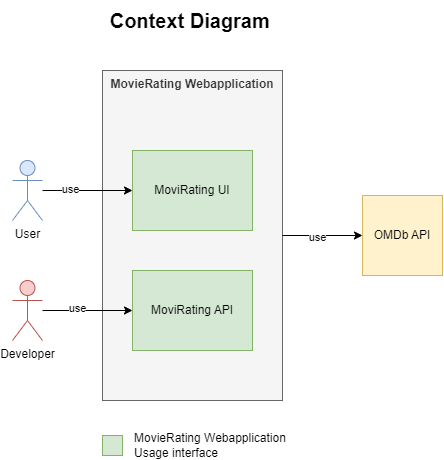
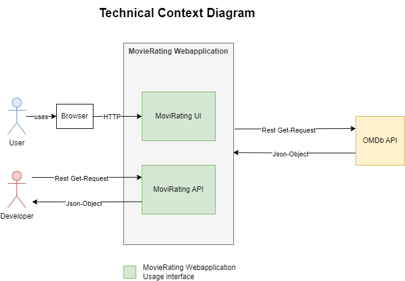
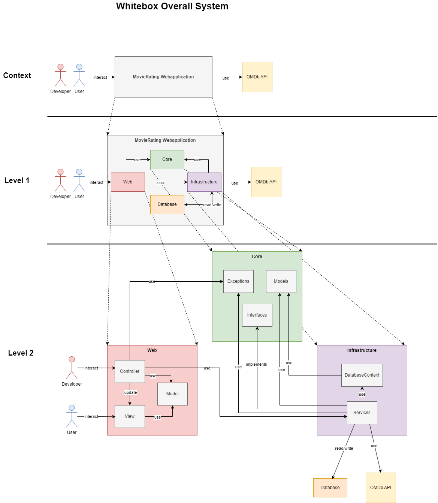
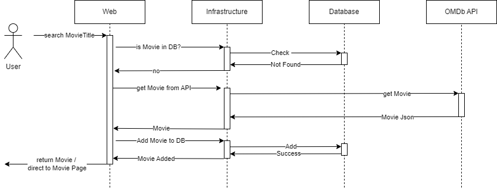
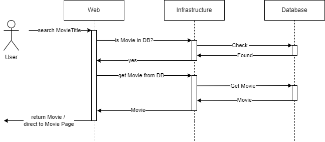
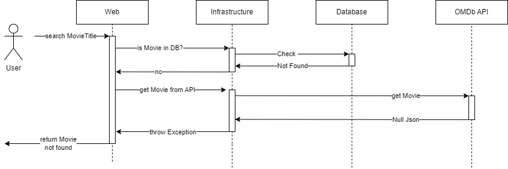
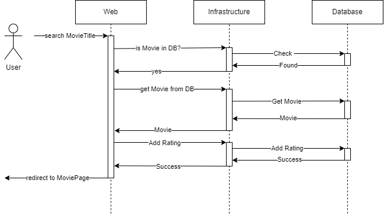
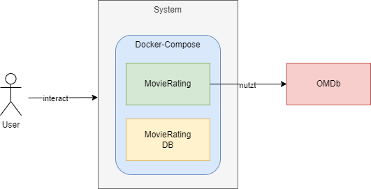
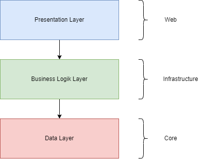
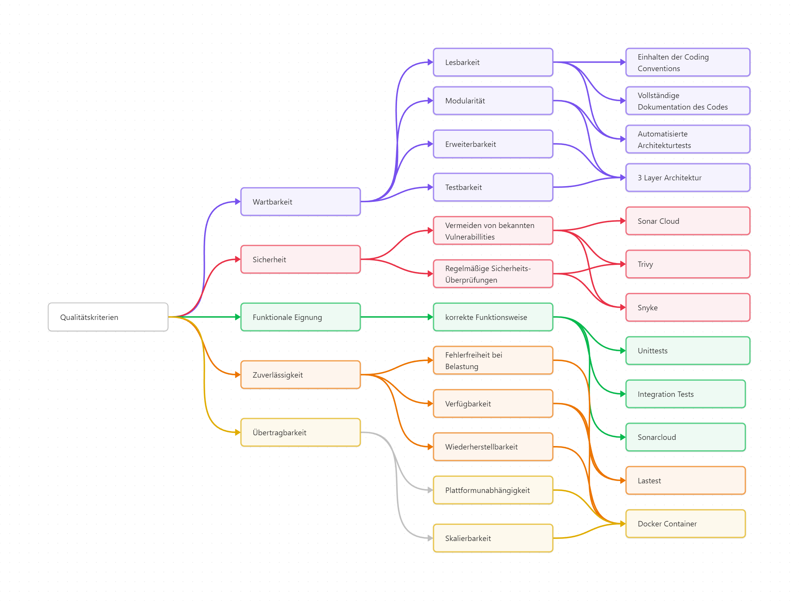

# MovieRating Webanwendung

# Einführung und Ziele

Das Programm, welches in dieser Dokumentation beschrieben wird, dient der Filmbewertung und wird in .NET 8 entwickelt. Es ruft Filmdaten von der OMDb API ab und ermöglicht es Benutzern, Bewertungen für Filme anzulegen und zu speichern. Das Projekt ist besonders darauf ausgelegt Maßnahmen, welche zur Sicherung der Qualität dienen, zu implementieren.

Die wesentlichen Anforderungen, Ziele und Steakholder werden im Folgenden beschrieben:

- Die zugrunde liegende Geschäftsidee besteht darin, ein Programm bereitzustellen, mittels welchem Filme angefragt werden können. Falls vorhanden, werden die Daten anschließend aus der lokalen Datenbank abgerufen. Sollten diese nicht vorhanden sein, erfolgt die Abfrage der Filme über die OMDb API. Zudem können Benutzer Ratings für Filme erstellen und speichern, die in der Datenbank verwaltet werden.

- Die wesentliche Aufgabenstellung umfasst das Empfangen von Filmabfragen über die REST API, die Rückgabe gespeicherter Filmdaten aus der Datenbank und die gegebenenfalls notwendige Nachfrage bei der OMDb API. Weiterhin müssen Funktionen zur Erstellung und Speicherung von Ratings für Filme bereitgestellt werden.

- Die funktionalen Anforderungen erfordern die Erfüllung der oben genannten Aufgabenstellungen sowie die Bereitstellung einer REST API, die es ermöglicht, Filmdaten abzurufen und alle in der Datenbank gespeicherten Filme zurückzugeben.

- Die Qualitätsziele der Architektur, die durch die N Layer Architecture mit den Schichten Core, Infrastructure und Web erreicht werden sollen, umfassen hohe Wartbarkeit und Erweiterbarkeit des Codes durch klare Trennung der Schichten
Testbarkeit und Vermeidung von Abhängigkeiten zwischen den Schichten

- Relevante Stakeholder sind der Endnutzer, der Dozent, der API-Anbieter und der Entwickler. Der Endnutzer erwartet sich von dem Programm eine kontinuierliche Bereitstellung von Funktionalität und Performance. Der Dozent erwartet sich eine vollständige Dokumentation des Projektes und des Codes und die Sicherstellung der Funktionalität und der Qualitätsziele. Der API-Anbieter erwartet eine effiziente Nutzung der OMDb API und eine damit verbundene Minimierung unnötiger Anfragen. Der Entwickler erwartet eine gute Dokumentation und Wartbarkeit des Codes, sowie die Einhaltung der Architekturprinzipien.

## Aufgabenstellung

Das Programm soll es ermöglichen, Filme abzurufen und dabei die Eigenschaften Titel, Regisseur, Laufzeit, Genre und Kurzbeschreibung anzuzeigen. Zudem sollen Nutzer die Möglichkeit haben, benutzerdefinierte Bewertungen für jeden Film zu erstellen. Diese Bewertungen müssen den Namen des Autors, einen Kommentar sowie eine Bewertung auf einer Skala von 1 bis 10 enthalten. Das Ziel des Programms ist es, eine Web-Oberfläche zu bieten, die sowohl die Informationen zu den Filmen darstellt als auch eine Möglichkeit zur Erstellung und Ansicht von Bewertungen bietet. Zudem sollen Filme, als auch alle in der Datenbank gespeicherten Filme über eine angebotene API abgefragt werden können.

| Use Case        | Beschreibung        | Ziele |
|--------------|----------------|-------------------|
| Film suchen | Ein Film wird mittels seines Titels gesucht | Bestimmte Daten des Films wiedergeben |
| Alle in der Datenbank gecachten Filme wiedergeben  | Alle in der Datenbank gecachten Filme wiedergeben  | Alle in der Datenbank gecachten Filme wiedergeben |
| Rating hinzufügen | Ein Rating zu einem bestimmten Film hinzugefügt | Rating in der Datenbank zu dem entsprechenden Film speichern |

## Qualitätsziele

| Priorität | Qualitätskriterium  | Ziele                                                                                                                                                     | Maßnahmen                                                                                                                                                      |
| --------- | ------------------- | --------------------------------------------------------------------------------------------------------------------------------------------------------- | -------------------------------------------------------------------------------------------------------------------------------------------------------------- |
| 1         | Wartbarkeit         | - Lesbarkeit durch gute Strukturierung und klare Namensgebung  - Modularität und damit verbundene Ersetzbarkeit - Erweiterbarkeit  - Testbarkeit | - N Layer Architecture  - automatisierte  Architekturtests - Vollständige Dokumentation des Code - Einhaltung der Coding Conventions - Sonarcloud  |
| 2         | Sicherheit          | - Vermeiden von Vulnerabillities - Regelmäßige Überprüfungen                                                                                           | trivy und snyk Dependency und Vulnerabillity Scan                                                                                                              |
| 3         | Funktionale Eignung | korrekte Funktionalität                                                                                                                                   | - Unittests  - Integrationtests  - Testcoverage von über 90%  - automatisierte Ausführung der Tests                                                   |
| 4         | Zuverlässigkeit     | - Verfügbarkeit  - Fehlerfreiheit  - Wiederherstellbarkeit                                                                                          | - Unittests  - Integratiotests  - Lasttest  - Verwendung von Docker                                                                                   |
| 5         | Übertragbarkeit     | - Plattformunabhängig  - Skalierbar                                                                                                                    | Verwendung von Docker                                                                                                                                          |

## Stakeholder

| Rolle        | Kontakt        | Erwartungshaltung |
|--------------|----------------|-------------------|
| Dozent | - | Vollständige Dokumentation des Projektes und des Codes und die Sicherstellung der Funktionalität und der Qualitätsziele |
| Entwickler | - | Gute Dokumentation und Wartbarkeit des Codes |
| API-Anbieter | bfritz@fadingsignal.com | Effiziente Nutzung der API (Minimierung unnötiger Anfragen) |
| Endnutzer | - | Kontinuierliche Bereitstellung von Funktionalität und Performance |

# Randbedingungen

Die folgenden Randbedingungen sind aus der Aufgabenstellung der Veranstaltung Software Qualitätssicherung (SQS) hervorgegangen.

| Randbedingung             | Beschreibung                                                                                                                        |
| ------------------------- | ----------------------------------------------------------------------------------------------------------------------------------- |
| Nutzung einer API         | Das Programm muss eine externe API abfragen.                                                                                        |
| Anbieten einer API        | Das Programm muss eine API bereitstellen, über welche Daten abgefragt werden können.                                                |
| Nutzung einer Datenbank   | Das Programm muss eine Datenbank benutzen.                                                                                          |
| Nutzung von Github        | Als Versionskontroll-Plattform muss Github benutzt werden. Wobei das Programm als ein öffentliches Repo bereitgestellt werden muss. |
| Einbindung von Tests      | Es müssen sowohl Unit-, als auch Intergation Tests benutzt werden.                                                                  |
| Automatisierung           | Automatisierung mittels CI/CD muss via Github Actions verwendet werden.                                                             |
| Einbindung von SonarCloud | Für statische Code Analyse muss SonarCloud verwendet werden.                                                                        |
| Deployment über Docker    | Für das Deployment, muss ein Docker Image bereitgestellt werden.                                                                    |

# Kontextabgrenzung

## Fachlicher Kontext

| Kommunikationsbeziehung      | Eingabe                                         | Ausgabe                            |
| ---------------------------- | ----------------------------------------------- | ---------------------------------- |
| User -> MovieRating UI       | Benutzerinteraktion wie Klicks und Texteingaben | Aktualisierte UI                   |
| Developer -> MovieRating API | Get Request                                     | Gewünschter Movie als Json Objekt  |
| MovieRating -> OMDb API      | Get Request                                     | Gewünschter Movie als Json Objetkt |

## Technischer Kontext

# Lösungsstrategie

- Nutzung der Programmiersprache C#, da sie dem Entwickler bekannt ist und somit keine Einarbeitungszeit notwendig ist
- Nutzung der N-Layer Architektur um Modularität zu gewährleisten
- Explizite Architekturtests um sicherstellen zu können, dass die Architektur eingehalten wurde
- Automatisierte Unit und Integration Tests um dauerhaft die Funktionalität der MovieRating Webanwendung sicherstellen zu können.

# Bausteinsicht
## Whitebox Gesamtsystem

### Begründung

Die Zerlegung des Gesamtsystems bis in die Komponenten Core, Infrastructure und Web ermöglicht die isolierte Ansicht der Verantwortungsbereiche der einzelnen Architekturkomponenten. Dies gibt einen guten Überblick über die Struktur des Programms und erleichtert somit die Orientierung und damit die Wartung des Programms.

### Enthaltene Bausteine

| Baustein                   | Verantwortung                                                               |
| -------------------------- | --------------------------------------------------------------------------- |
| MovieRating Webapplication | Gesamte Programlogik                                                        |
| Core                       | Bereitstellen der grundlegenden Modelle und Interfaces                      |
| Infrastructure             | Bereitstellen der Daten                                                     |
| Web                        | Bereitstellen der UI und der API                                            |
| Datenbank                  | Speicherung der Daten                                                       |
| Exceptions                 | Enthält Exceptions für Programmspezifische Ereignisse                       |
| Core Models                | Enthält gundlegende Modelle wie Movie und Rating                            |
| Interfaces                 | Stellt den Bauplan für die Services bereit                                  |
| DatabaseContext            | Enhält die Datenbankstrukutr                                                |
| Services                   | Stellen die Daten Move und Rating bereit und speichern sie ab               |
| Controller                 | Stellen Daten für die Views bereit und updaten diese                        |
| Web Models                 | Enthält die Datenmodelle für die Kommunikation zwischen Controller und View |
| View                       | Stellt die UI bereit                                                        |

### Wichtige Schnittstellen

- HTTP: Interaktion zwischen Nutzer und Programm
- REST: Interaktion zwischen Entwickler und Movie API, sowie zwischen MovieRating Webanwendung und OMDb API

### Blackbox-Beschreibung Level 1

#### Core
 - Zweck/Verantwortung: Enthält alle Komponenten welche keine Abhängigkeiten besitzen und wiederverwendet werden
 - Schnittstellen: /
 - Qualitätsmerkmale: Core darf keine Abhängigkeiten besitzen und hat somit Qualitätsmerkmale an die Architektur

#### Infrastructure
 - Zweck/Verantwortung: Bereitstellen und Verwaltung von Daten, dies umfasst das Lesen und Schreiben in die Datenbank, als auch das Holen der Movie Daten von der OMDb API.
 - Schnittstellen: REST Schnittstelle zu der OMDb API
 - Qualitätsmerkmale: Funktionale Eignung und Sicherheit (keine Technologien mit bekannten Vulnerabillites benutzen)

 #### Web
 - Zweck/Verantwortung: Bereitstellen der der UIs und der API
 - Schnittstellen: bietet zwei REST Endpunkte an (API)
 - Qualitätsmerkmale: funktionale Eignung, Sicherheit (keine Technologien mit bekannten Vulnerabillites benutzen) und Belastbarkeit (API)

Die Datenbank wird nicht weiter als Blackbox beschrieben, da sie weder Schnittstellen noch besondere Qualitätsmerkmale besitzt.

Die Blackboxes in Level 2 werden ebenfalls nicht weiter beschrieben da ihre Schnittstellen und Qualitätsmerkmale mit den zuvor genannten übereinstimmen. Zudem wird auf die Blackboxes in Level 2 im folgenden Kapitel, in welchem auf dei Whiteboxes genauger eingegangen wird, erklärt.

### Level 2 Whiteboxes

#### Core
- Innere Bausteine: Interfaces, Exceptions, Models
- Beschreibung: Die Core Komponenten stellen den Kern des Programms dar. Alle Strukturen, welche keine Abhängigkeiten haben und an mehreren Stellen verwendet werden, befinden sich in Core. 
    - Exceptions: Umfasst Exceptions für besondere Fälle, wie zum Beispiel, wenn der Film in der OMDb Datenbank nicht existiert, oder wenn Umgebungsvariablen nicht gesetzt wurden.
    - Models: Umfasst die Grundstruktur für Objekte Movie und Rating, beinhaltet aber ebenfalls das MovieDTO Objekt, mit welchem die Daten von der OMDb API in ein Movie Objekt umgewandelt werden können. 
    - Interfaces: Enthält Baupläne für alle Services in Infrastructure. Darunter beispielsweise um die OMDb API anzusprechen oder alle Ratings zu einem Movie zu erhalten.

#### Infrastructure
- Innere Bausteine: DatabseContext, Services
- Beschreibung: Alle Infrastructure Komponenten dienen der Kommunikation mit der Datenbank oder Verwaltung von Movie und Rating Objekten, mittels der Datenbank oder der OMDb API.
    - DatabaseContext: Enthält die Datenbank Enitäten Movie und Rating und gibt damit die Struktur der Datenbank vor
    - Services: 
        - ConfigService: Über diese Service können die Umgebungsvariablen konfiguriert werden
        - InfoService: über diesen Service wird ein Movie von der OMDb API geholt
        - MovieService: Über diesen Service werden die Movies verwaltet. Dies beeinhaltet unteranderem das Hinzufügen und das Auslesen eines Movies aus der Datenbank
        - Rating Service: Über diesen Service werden die Ratings verwaltet. Dies beeinhaltet unteranderem das Hinzufügen und das Auslesen eines Ratings aus der Datenbank

#### Web
- Innere Bausteine: Controller, Model, View
- Beschreibung: Alle Web Komponenten dienen der Nutzer Interaktion, entweder über die bereitgestellten Webseiten oder die API. 
    - Controller: Die Controller reagieren auf Nutzereingaben in den entsprechenden Views und beschaffen die angeforderten Daten, um die Ansicht anschließend zu aktualisieren. Ein Beispiel dafür ist der MovieController, der aktiv wird, sobald der Nutzer nach einem bestimmten Film sucht. Der MovieController nutzt die in der Infrastruktur bereitgestellten Services, um nach dem Film zu suchen, und aktualisiert die Ansicht mit den gefundenen Daten.
    - Model: Die Models dienen als Zwischenschicht zwischen der Logik in den Controllern und der Benutzeroberfläche in den Views. Die vom Controller aktualisierten Daten werden im entsprechenden Model gespeichert. Das Model wird in der View ausgelesen, wodurch die Ansicht auf der Webseite aktualisiert und die neuesten Daten angezeigt werden können.
    - View: Die Views dienen der Bereitstellung der Webseiten und sind in HTML geschrieben. Über die Views kann der Benutzer mit der Anwendung interagieren. Die Views werden von den Controllern aktualisiert, um die Benutzeroberfläche mit den neuesten Daten und Informationen zu versorgen.

# Laufzeitsicht

## Movie not in Cache

- Zuerst wird geprüft ob sich der Film im Cache befindet
- Falls dies nicht der Fall ist wird er von der OMDb API geholt 
- Damit er beim nächsten Mal direkt aus dem Cache geholt werden kann wird er in die Datenbank gespeichert
- Je nachdem ob der Request von der API oder der UI kam, wird entweder der Movie als Json Objekt zurück geliefert oder der User auf die Seite mit den Filmdetails weitergeleitet
## Movie in Cache

- Selbes Prinzip wie in "Movie not in Cache" 
- Mit dem Unterschied das der Film im Cache gefunden wird und somit direkt zurückgegeben werden kann
## Unkown Movie

- Wenn der Film nicht existiert, befindet er sich weder im Cache, noch kann er über die OMDb API gefunden werden
- Dabei wirft der InfoService in Infrastructure eine Exception
- Diese wird im Controller in Web aufgefangen und ein 404 zurückgegeben
## Create Rating

- Wenn ein Rating erstellt werden soll, wird zunächst überprüft ob sich der Film im Cache befindet
- Falls dies der Fall ist wird er aus der Datenbank geladen und mit dem Rating verknüpft
- Das Rating wird anschließend in die Datenbank gespeichert und der Nutzer auf die Movie Seite weitergeleitet, auf welcher die Filmdetails und die entsprechenden Ratings gelistet sind
- Falls sich der Film nicht in der Datenbank befinden sollte, wird ein 404 zurückgegeben
- Die Rating können nur über die UI hinzugefügt werden, über die API ist nur das Auslesen möglich
# Verteilungssicht

Die Software soll als ein Docker-Compose System auf dem Zielsystem laufen. Somit ist es unabhängig von der Hardware des Systems.
Die Docker-Compose Umgebung besteht aus zwei Container. Zum einen dem MovieRating Programm und der MovieRating DB.

Bevor das Projekt mit `docer compose up` gestartet werde kann müssen folgende Umgebungsvariablen Gesetzt sein:

| Umgebungsvariable | Wert                        |
| ----------------- | --------------------------- |
| API_KEY           | OMDb API Key                |
| DB_PASSWORD       | SQL Server Passwort         |
| DB_SERVER         | Hostname des SQL Server     |
| DB_USER           | Benutzername des SQL Server |

# Querschnittliche Konzepte

## Architektur

Das Programm wurde in C# entwickelt und verwendet eine N-Layer-Architektur, speziell eine 3-Layer-Architektur. Diese Architektur besteht aus drei Hauptschichten:
- Dem Presentation Layer, der als Web implementiert ist, stellt die Benutzeroberfläche dar und ermöglicht die Interaktion mit dem Benutzer. 
- Der Business Logic Layer, welcher als Infrastructure implementiert ist, beinhaltet die Logik der Anwendung. Hier werden alle Services umgesetzt, welche die Anwendung steuern. 
- Der Data Layer, genannt Core, enthält alle Modelle und Strukturen welche keine Abhängigkeiten besitzen. Daher können Strukturen aus diesem Layer Problemlos in anderen Projekten verwendet werden.

Diese Architektur bietet mehrere Vorteile. Sie fördert unteranderem eine klare Strukturierung des Codes, was die Wartbarkeit erleichtert, da Änderungen in einer Schicht durchgeführt werden können, ohne die anderen zu beeinträchtigen. 
Jede Schicht kann unabhängig getestet werden, was die Qualitätssicherung und Fehlerbehebung vereinfacht. 
Die Modularität ermöglicht es, Komponenten in verschiedenen Projekten wiederzuverwenden und die Gesamtkomplexität des Systems zu reduzieren. Dies trifft vor allem auf Core zu.
Diese Architektur bietet eine solide Grundlage für skalierbare und flexible Anwendungen, weshalb sie weit verbreitet ist und beispielsweise von [IBM](https://www.ibm.com/de-de/topics/three-tier-architecture#:~:text=Die%20dreischichtige%20Architektur%2C%20die%20Anwendungen,traditionelle%20Client%2DServer%2DAnwendungen.) empfohlen wird.

## Unittests 

Das Programm ist mit Unittests abgesichert, welche ebenfalls in der Pipeline ausgeführt werden. Es wurde zudem die Richtlinie verfolgt, dass zu jedem neuen Code Unittests geschrieben werden müssen. Daraus ergeben sich mehrere Vorteile:
1. Die frühzeitige Erkennung von Fehlern, wodurch diese schnell behoben werden können. 
2. Die kontinuierliche Verbesserung der Codequalität, da Unittests sicherstellen, dass der Code den gewünschten Spezifikationen entspricht und keine unerwarteten Fehler auftreten. 
3. Die erhöhte Wartbarkeit des Codes, da Änderungen und Erweiterungen vorgenommen werden können, ohne dass bestehende Funktionen beeinträchtigt werden. 
4. Schließlich bieten Unittests eine Form der Dokumentation, die das Verständnis und die Implementierung des Codes für andere Entwickler erleichtert.

## Einhaltung der Coding Conventions

In dem Programm wurde darauf geachtet, dass die Coding Conventions von C# eingehalten werden, was die Konsistenz im Code fördert. Dadurch wird der Code einheitlich und leichter lesbar ist. Dies erleichtert das Verständnis und die Wartung, da neue Entwickler sich schneller in den Code einarbeiten können.

## Dokumentation

In diesem Projekt wurde viel Wert auf die Dokumentation gelegt. Neben diesem ausführlichen Dokument ist der gesamte Code mit Kommentaren dokumentiert; jede Klasse und jede Methode, einschließlich der Testklassen, sind umfassend kommentiert. Diese sorgfältige Dokumentation hat mehrere Vorteile, insbesondere für die Wartbarkeit des Projekts. 

# Architekturentscheidungen

Als Programmiersprache wurde C# verwendet, da der Entwickler mit dieser Sprache vertraut war und dies Programmiersprache umfangreiche Bibliotheken bietet eine Webanwendung zu bauen. Alternativen wären beispielsweise Java oder Python gewesen. In diesen hatte der Entwickler jedoch weniger Erfahrung.

Die Architekturentscheidungen wurden bereits in Kapitel Querschnittlich Konzepte und der Bausteinsicht beschrieben und werden daher hier nicht mehr explizit genannt.

# Qualitätsanforderungen

## Qualitätsbaum

## Qualitätsszenarien

| Qualitätsmerkmal    | Art      | Szenario                                                                                                                                                                                                                                | Maßnahme                                                                     |
| ------------------- | -------- | --------------------------------------------------------------------------------------------------------------------------------------------------------------------------------------------------------------------------------------- | ---------------------------------------------------------------------------- |
| Wartbarkeit         | Änderung | Ein neuer Entwickler wird für das Programm benötigt und daher muss dieses lesbar sein, damit die Einarbeitungszeit möglichst kurz ist.                                                                                                  | - Vollständige Dokumentation des Codes - Einhalten von Coding Conventions |
|                     | Nutzung  | Mehrere Entwickler arbeiten an dem Programm und tauschen die Gebiete an denen sie arbeiten. Dafür sollten die Bennungen und die Dokumentation des Codes in Programm einheitlich sein, damit sich die Entwickler nicht umstellen müssen. | - Vollständige Dokumentation des Codes - Einhalten von Coding Conventions |
|                     | Änderung | Das Programm soll um einen Authentifizierungsservice erweitert werden, wenn die Architektur eingehalten wurde, ist dies leicht möglich                                                                                                  | - 3 Layer Architektur -Automatisierter Architekturtest                    |
|                     | Änderung | Über die API sollen nur ebenfalls Ratings hinzugefügt werden können, wenn die Architektur eingehalten wurde ist dies leicht umsetzbar                                                                                                   | - 3 Layer Architektur -Automatisierter Architekturtest                    |
| Sicherheit          | Nutzung  | Eine verwendete Bibliothek hat eine neu gefundene Vulnerabilität                                                                                                                                                                        | - Snyke - Trivy                                                           |
|                     | Änderung | Der SQL Server des Programms wird auf eine andere DB umgestellt, diese hat nur leider eine Sicherheitslücke.                                                                                                                            | - Snyke - Trivy                                                        |
|                     | Änderung | Ein unerfahrener Entwickler erweitert das Programm und fügt diesem dabei einen Security Hotspot hinzu, indem er eine als deprecated markierte Funktion verwendet                                                                        | - Sonarcloud                                                                 |
| Funktionale Eignung | Änderung | Das Datenbankschema wird verändert und es wird vergessen einen Service anzupassen.                                                                                                                                                      | - Unittests - Integrationtest                                             |
|                     | Änderung | Bei dem upgrade von dotnet 8 auf dotnet 10 verändern sich einige Funktionalitäten, die korrekte Funktionalität kann mit Tests dennoch gegeben werden                                                                                    | - Unittests - Integrationtest                                             |
| Zuverlässigkeit     | Änderung | Die Datenbank wird gewechselt, wobei die neue Datenbank einen Leistungsengpass darstellt, welche jedoch nur bei starker Belastung bemerkbar ist                                                                                         | - automatisierte Lasttests                                                   |
|                     | Nutzung  | Das Programm ist überlastet und beendet sich, es muss so schnell wie möglich wieder funktionsfähig sein                                                                                                                                 | - Docker Container                                                           |
| Übertragbarkeit     | Änderung | Die Serverhardware auf dem das Programm ausgeführt wird, soll grundlegend geändert werden.                                                                                                                                              | - Docker Container                                                           |

# Risiken und technische Schulden

| Risiko                     | Beschreibung                                                                  | Maßnahmen                                                                     | Priorität |
| -------------------------- | ----------------------------------------------------------------------------- | ----------------------------------------------------------------------------- | --------- |
| Fehlerhaftes Verhalten     | Das Programm verhält sich nicht wie  zuvor spezifiziert.                   | - Unittests - Integration Tests - Testabdeckung > 90 % - Sonar Cloud | hoch      |
| Sicherheitslücken          | Das Programm enthält bekannte Vulnerabilitäten, die ausgenutzt werden könnten | - Sonar Cloud - regelmäßige Vulnerabillity-Checks durch trivy und snyke    | hoch      |
| Verletzung der Architektur | Die zuvor definierte Architektur wird nicht eingehalten                       | - Automatisierter Architekturtest                                             | hoch      |
| OMDb API                   | Die OMDb API könnte überlastet sein, oder ihre Schnittstelle ändern           | - Speichern der Filmdaten in der MovieRate Datenbank                          | mittel    |

# Glossar

| Begriff    | Definition                          |
| ---------- | ----------------------------------- |
| C#         | Gewählte Programmiersprache         |
| SQL Server | Relationale Datenbank von Microsoft |
