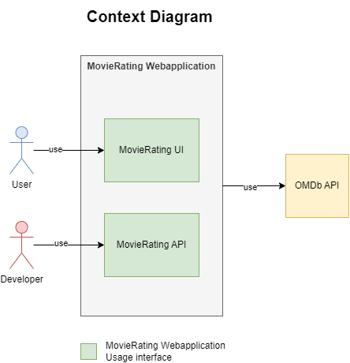
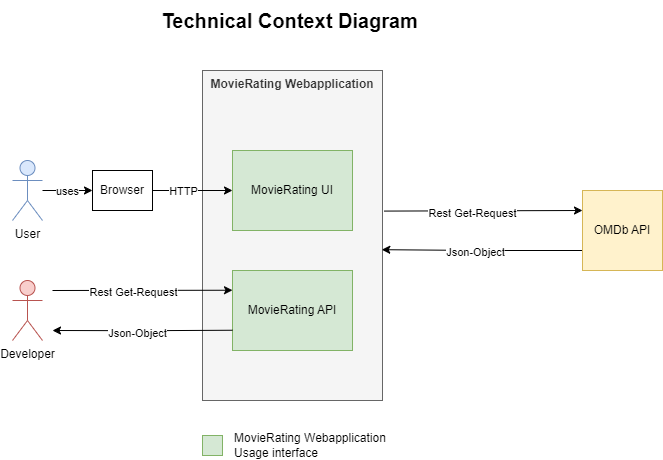
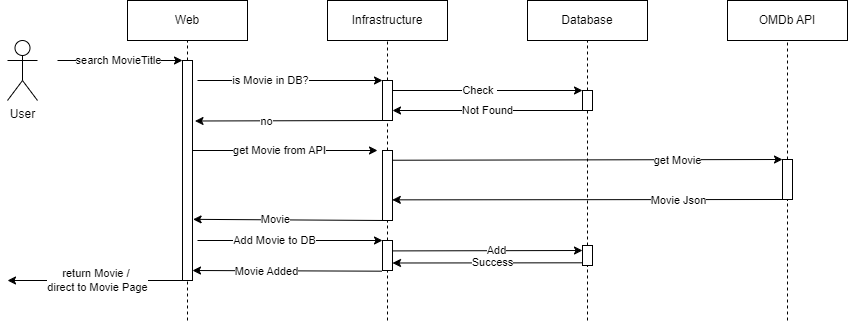

# MovieRating Webanwendung

**Über arc42**

arc42, das Template zur Dokumentation von Software- und
Systemarchitekturen.

Template Version 8.2 DE. (basiert auf AsciiDoc Version), Januar 2023

Created, maintained and © by Dr. Peter Hruschka, Dr. Gernot Starke and
contributors. Siehe <https://arc42.org>.

Diese Version des Templates enthält Hilfen und Erläuterungen. Sie dient
der Einarbeitung in arc42 sowie dem Verständnis der Konzepte. Für die
Dokumentation eigener System verwenden Sie besser die *plain* Version.

# Einführung und Ziele

Das Programm, welhes in dieser Dokumentation beschrieben wird, dient der Filmbewertung und wird in .NET 8 entwickelt. Es ruft Filmdaten von der OMDb API ab und ermöglicht es Benutzern, Bewertungen für Filme anzulegen und zu speichern. Das Projekt ist besonders darauf ausgelegt Maßnahmen, welche zur Sicherung der Qualität dienen, zu implementieren.

Die wesentlichen Anforderungen, Ziele und Steakholder werden im Folgenden beschrieben:

- Die zugrunde liegende Geschäftsidee besteht darin, ein Programm bereitzustellen, mittels welchem Filme angefragt werden können. Falls vorhanden, werden die Daten anschließend aus der lokalen Datenbank abgerufen. Sollten diese nicht vorhanden sein, erfolgt die Abfrage der Filme über die OMDb API. Zudem können Benutzer Ratings für Filme erstellen und speichern, die in der Datenbank verwaltet werden.

- Die wesentliche Aufgabenstellung umfasst das Empfangen von Filmabfragen über die REST API, die Rückgabe gespeicherter Filmdaten aus der Datenbank und die gegebenenfalls notwendige Nachfrage bei der OMDb API. Weiterhin müssen Funktionen zur Erstellung und Speicherung von Ratings für Filme bereitgestellt werden.

- Die funktionalen Anforderungen erfordern die Erfüllung der oben genannten Aufgabenstellungen sowie die Bereitstellung einer REST API, die es ermöglicht, Filmdaten abzurufen und alle in der Datenbank gespeicherten Filme zurückzugeben.

- Die Qualitätsziele der Architektur, die durch die N Layer Architecture mit den Schichten Core, Infrastructure und Web erreicht werden sollen, umfassen hohe Wartbarkeit und Erweiterbarkeit des Codes durch klare Trennung der Schichten
Testbarkeit und Vermeidung von Abhängigkeiten zwischen den Schichten

- Relevante Stakeholder sind der Endnutzer, der Dozent, der API-Anbieter und der Entwickler. Der Endnutzer erwartet sich von dem Programm eine kontinuierliche Bereitstellung von Funktionalität und Performance. Der Dozent erwartet sich eine vollständige Dokumentation des Projektes und des Codes und die Sicherstellung der Funktionalität und der Qualitätsziele. Der API-Anbieter erwartet eine effiziente Nutzung der OMDb API und eine damit verbundene Minimierung unnötiger Anfragen. Der Entwickler erwartet eine gute Dokumentation und Wartbarkeit des Codes, sowie die Einhaltung der Architekturprinzipien.

## Aufgabenstellung

Das Programm soll es ermöglichen, Filme abzurufen und dabei die Eigenschaften Titel, Regisseur, Laufzeit, Genre und Kurzbeschreibung anzuzeigen. Zudem sollen Nutzer die Möglichkeit haben, benutzerdefinierte Bewertungen für jeden Film zu erstellen. Diese Bewertungen müssen den Namen des Autors, einen Kommentar sowie eine Bewertung auf einer Skala von 1 bis 10 enthalten. Das Ziel des Programms ist es, eine Web-Oberfläche zu bieten, die sowohl die Informationen zu den Filmen darstellt als auch eine Möglichkeit zur Erstellung und Ansicht von Bewertungen bietet. Zudem sollen Filme, als auch alle in der Datenbank gespeicherten Filme über eine angebotene API abgefragt werden können.

| Use Case        | Beschreibung        | Ziele |
|--------------|----------------|-------------------|
| Film suchen | Ein Film wird mittels seines Titels gesucht | Bestimmte Daten des Films wiedergeben |
| Alle in der Datenbank gecachten Filme wiedergeben  | Alle in der Datenbank gecachten Filme wiedergeben  | Alle in der Datenbank gecachten Filme wiedergeben |
| Rating hinzufügen | Ein Rating zu einem bestimmten Film hinzugefügt | Rating in der Datenbank zu dem entsprechenden Film speichern |

## Qualitätsziele

| Priorität | Qualitätskriterium  | Ziele                                                                                                                                                     | Maßnahmen                                                                                                    |
| --------- | ------------------- | --------------------------------------------------------------------------------------------------------------------------------------------------------- | ------------------------------------------------------------------------------------------------------------ |
| 1         | Wartbarkeit         | - Lesbarkeit durch gute Strukturierung und klare Namensgebung  - Modularität und damit verbundene Ersetzbarkeit - Erweiterbarkeit  - Testbarkeit | - N Layer Architecture  - automatisierte  Architekturtests                                                |
| 2         | Sicherheit          | Vermeiden von Vulnerabillities                                                                                                                            | trivy und snyk Dependency und Vulnerabillity Scan                                                            |
| 3         | Funktionale Eignung | korrekte Funktionalität                                                                                                                                   | - Unittests  - Integrationtests  - Testcoverage von über 90%  - automatisierte Ausführung der Tests |
| 4         | Zuverlässigkeit     | - Verfügbarkeit  - Fehlerfreiheit  - Wiederherstellbarkeit                                                                                          | - Unittests  - Integratiotests  - Lasttest  - Verwendung von Docker                                 |
| 5         | Übertragbarkeit     | - Plattformunabhängig  - Skalierbar                                                                                                                    | Verwendung von Docker                                                                                        |

## Stakeholder

| Rolle        | Kontakt        | Erwartungshaltung |
|--------------|----------------|-------------------|
| Dozent | - | Vollständige Dokumentation des Projektes und des Codes und die Sicherstellung der Funktionalität und der Qualitätsziele |
| Entwickler | - | Gute Dokumentation und Wartbarkeit des Codes |
| API-Anbieter | bfritz@fadingsignal.com | Effiziente Nutzung der API (Minimierung unnötiger Anfragen) |
| Endnutzer | - | Kontinuierliche Bereitstellung von Funktionalität und Performance |

# Randbedingungen

Die folgenden Randbedingungen sind aus der Aufgabenstellung der Veranstaltung Software Qualitätssicherung (SQS) hervorgegangen.

| Randbedingung             | Beschreibung                                                                                                                        |
| ------------------------- | ----------------------------------------------------------------------------------------------------------------------------------- |
| Nutzung einer API         | Das Programm muss eine externe API abfragen.                                                                                        |
| Anbieten einer API        | Das Programm muss eine API bereitstellen, über welche Daten abgefragt werden können.                                                |
| Nutzung einer Datenbank   | Das Programm muss eine Datenbank benutzen.                                                                                          |
| Nutzung von Github        | Als Versionskontroll-Plattform muss Github benutzt werden. Wobei das Programm als ein öffentliches Repo bereitgestellt werden muss. |
| Einbindung von Tests      | Es müssen sowohl Unit-, als auch Intergation Tests benutzt werden.                                                                  |
| Automatisierung           | Automatisierung mittels CI/CD muss via Github Actions verwendet werden.                                                             |
| Einbindung von SonarCloud | Für statische Code Analyse muss SonarCloud verwendet werden.                                                                        |
| Deployment über Docker    | Für das Deployment, muss ein Docker Image bereitgestellt werden.                                                                    |

# Kontextabgrenzung

## Fachlicher Kontext

| Kommunikationsbeziehung      | Eingabe                                         | Ausgabe                            |
| ---------------------------- | ----------------------------------------------- | ---------------------------------- |
| User -> MovieRating UI       | Benutzerinteraktion wie Klicks und Texteingaben | Aktualisierte UI                   |
| Developer -> MovieRating API | Get Request                                     | Gewünschter Movie als Json Objekt  |
| MovieRating -> OMDb API      | Get Request                                     | Gewünschter Movie als Json Objetkt |

## Technischer Kontext

# Lösungsstrategie

- Nutzung der Programmiersprache C#, da sie dem Entwickler bekannt ist und somit keine Einarbeitungszeit notwendig ist
- Nutzung der N-Layer Architektur um Modularität zu gewährleisten
- Explizite Architekturtests um sicherstellen zu können, dass die Architektur eingehlaten wurde
- Automatisierte Unit und Integration Tests um dauerhaft die Funktionalität der MovieRating Webanwendung sicherstellen zu können.

# Bausteinsicht
## Whitebox Gesamtsystem

### Begründung

Die Zerlegung des Gesamtsystems bis in die Komponenten Core, Infrastructure und Web ermöglicht die isolierte Ansicht der Verantwortungsbereiche der einzelnen Architekturkomponenten. Dies gibt einen guten Überblick über die Struktur des Programms und erleichtert somit die Orientierung und damit die Wartung des Programms.

### Enthaltene Bausteine

| Baustein                   | Verantwortung                                                               |
| -------------------------- | --------------------------------------------------------------------------- |
| MovieRating Webapplication | Gesamte Programlogik                                                        |
| Core                       | Bereitstellen der grundlegenden Modelle und Interfaces                      |
| Infrastructure             | Bereitstellen der Daten                                                     |
| Web                        | Bereitstellen der UI und der API                                            |
| Datenbank                  | Speicherung der Daten                                                       |
| Exceptions                 | Enthält Exceptions für Programmspezifische Ereignisse                       |
| Core Models                | Enthält gundlegende Modelle wie Movie und Rating                            |
| Interfaces                 | Stellt den Bauplan für die Services bereit                                  |
| DatabaseContext            | Enhält die Datenbankstrukutr                                                |
| Services                   | Stellen die Daten Move und Rating bereit und speichern sie ab               |
| Controller                 | Stellen Daten für die Views bereit und updaten diese                        |
| Web Models                 | Enthält die Datenmodelle für die Kommunikation zwischen Controller und View |
| View                       | Stellt die UI bereit                                                        |

### Wichtige Schnittstellen

- HTTP: Interaktion zwischen Nutzer und Programm
- REST: Interaktion zwischen Entwickler und Movie API, sowie zwischen MovieRating Webanwendung und OMDb API

### Blackbox-Beschreibung Level 1

#### Core
 - Zweck/Verantwortung: Enthält alle Komponenten welche keine Abhängigkeiten besitzen und wiederverwendet werden
 - Schnittstellen: /
 - Qualitätsmerkmale: Core darf keine Abhängigkeiten besitzen und hat somit Qualitätsmerkmale an die Architektur

#### Infrastructure
 - Zweck/Verantwortung: Bereitstellen und Verwaltung von Daten, dies umfasst das Lesen und Schreiben in die Datenbank, als auch das Holen der Movie Daten von der OMDb API.
 - Schnittstellen: REST Schnittstelle zu der OMDb API
 - Qualitätsmerkmale: Funktionale Eignung und Sicherheit (keine Technologien mit bekannten Vulnerabillites benutzen)

 #### Web
 - Zweck/Verantwortung: Bereitstellen der der UIs und der API
 - Schnittstellen: bietet zwei REST Endpunkte an (API)
 - Qualitätsmerkmale: funktionale Eignung, Sicherheit (keine Technologien mit bekannten Vulnerabillites benutzen) und Belastbarkeit (API)

Die Datenbank wird nicht weiter als Blackbox beschrieben, da sie weder Schnittstellen noch besondere Qualitätsmerkmale besitzt.

Die Blackboxes in Level 2 werden ebenfalls nicht weiter beschrieben da ihre Schnittstellen und Qualitätsmerkmale mit den zuvor genannten übereinstimmen. Zudem wird auf die Blackboxes in Level 2 im folgenden Kapitel, in welchem auf dei Whiteboxes genauger eingegangen wird, erklärt.

### Level 2 Whiteboxes

#### Core
- Innere Bausteine: Interfaces, Exceptions, Models
- Beschreibung: Die Core Komponenten stellen den Kern des Programms dar. Alle Strukturen, welche keine Abhängigkeiten haben und an mehreren Stellen verwendet werden, befinden sich in Core. 
    - Exceptions: Umfasst Exceptions für besondere Fälle, wie zum Beispiel, wenn der Film in der OMDb Datenbank nicht existiert, oder wenn Umgebungsvariablen nicht gesetzt wurden.
    - Models: Umfasst die Grundstruktur für Objekte Movie und Rating, beinhaltet aber ebenfalls das MovieDTO Objekt, mit welchem die Daten von der OMDb API in ein Movie Objekt umgewandelt werden können. 
    - Interfaces: Enthält Baupläne für alle Services in Infrastructure. Darunter beispielsweise um die OMDb API anzusprechen oder alle Ratings zu einem Movie zu erhalten.

#### Infrastructure
- Innere Bausteine: DatabseContext, Services
- Beschreibung: Alle Infrastructure Komponenten dienen der Kommunikation mit der Datenbank oder Verwaltung von Movie und Rating Objekten, mittels der Datenbank oder der OMDb API.
    - DatabaseContext: Enthält die Datenbank Enitäten Movie und Rating und gibt damit die Struktur der Datenbank vor
    - Services: 
        - ConfigService: Über diese Service können die Umgebungsvariablen konfiguriert werden
        - InfoService: über diesen Service wird ein Movie von der OMDb API geholt
        - MovieService: Über diesen Service werden die Movies verwaltet. Dies beeinhaltet unteranderem das Hinzufügen und das Auslesen eines Movies aus der Datenbank
        - Rating Service: Über diesen Service werden die Ratings verwaltet. Dies beeinhaltet unteranderem das Hinzufügen und das Auslesen eines Ratings aus der Datenbank

#### Web
- Innere Bausteine: Controller, Model, View
- Beschreibung: Alle Web Komponenten dienen der Nutzer Interaktion, entweder über die bereitgestellten Webseiten oder die API. 
    - Controller: Die Controller reagieren auf Nutzereingaben in den entsprechenden Views und beschaffen die angeforderten Daten, um die Ansicht anschließend zu aktualisieren. Ein Beispiel dafür ist der MovieController, der aktiv wird, sobald der Nutzer nach einem bestimmten Film sucht. Der MovieController nutzt die in der Infrastruktur bereitgestellten Services, um nach dem Film zu suchen, und aktualisiert die Ansicht mit den gefundenen Daten.
    - Model: Die Models dienen als Zwischenschicht zwischen der Logik in den Controllern und der Benutzeroberfläche in den Views. Die vom Controller aktualisierten Daten werden im entsprechenden Model gespeichert. Das Model wird in der View ausgelesen, wodurch die Ansicht auf der Webseite aktualisiert und die neuesten Daten angezeigt werden können.
    - View: Die Views dienen der Bereitstellung der Webseiten und sind in HTML geschrieben. Über die Views kann der Benutzer mit der Anwendung interagieren. Die Views werden von den Controllern aktualisiert, um die Benutzeroberfläche mit den neuesten Daten und Informationen zu versorgen.

# Laufzeitsicht

## Movie not in Cache

- Zuerst wird geprüft ob sich der Film im Cache befindet
- Falls dies nicht der Fall ist wird er von der OMDb API geholt 
- Damit er beim nächsten Mal direkt aus dem Cache geholt werden kann wird er in die Datenbank gespeichert
- Je nachdem ob der Request von der API oder der UI kam, wird entweder der Movie als Json Objekt zurück geliefert oder der User auf die Seite mit den Filmdetails weitergeleitet
## Movie in Cache

- Selbes Prinzip wie in "Movie not in Cache" 
- Mit dem Unterschied das der Film im Cache gefunden wird und somit direkt zurückgegeben werden kann
## Unkown Movie

- Wenn der Film nicht existiert, befindet er sich weder im Cache, noch kann er über die OMDb API gefunden werden
- Dabei wirft der InfoService in Infrastructure eine Exception
- Diese wird im Controller in Web aufgefangen und ein 404 zurückgegeben
## Create Rating

![[CreateRating.png]]

- Wenn ein Rating erstellt werden soll, wird zunächst überprüft ob sich der Film im Cache befindet
- Falls dies der Fall ist wird er aus der Datenbank geladen und mit dem Rating verknüpft
- Das Rating wird anschließend in die Datenbank gespeichert und der Nutzer auf die Movie Seite weitergeleitet, auf welcher die Filmdetails und die entsprechenden Ratings gelistet sind
- Falls sich der Film nicht in der Datenbank befinden sollte, wird ein 404 zurückgegeben
- Die Rating können nur über die UI hinzugefügt werden, über die API ist nur das Auslesen möglich
# Verteilungssicht

**Inhalt**

Die Verteilungssicht beschreibt:

1.  die technische Infrastruktur, auf der Ihr System ausgeführt wird,
    mit Infrastrukturelementen wie Standorten, Umgebungen, Rechnern,
    Prozessoren, Kanälen und Netztopologien sowie sonstigen
    Bestandteilen, und

2.  die Abbildung von (Software-)Bausteinen auf diese Infrastruktur.

Häufig laufen Systeme in unterschiedlichen Umgebungen, beispielsweise
Entwicklung-/Test- oder Produktionsumgebungen. In solchen Fällen sollten
Sie alle relevanten Umgebungen aufzeigen.

Nutzen Sie die Verteilungssicht insbesondere dann, wenn Ihre Software
auf mehr als einem Rechner, Prozessor, Server oder Container abläuft
oder Sie Ihre Hardware sogar selbst konstruieren.

Aus Softwaresicht genügt es, auf die Aspekte zu achten, die für die
Softwareverteilung relevant sind. Insbesondere bei der
Hardwareentwicklung kann es notwendig sein, die Infrastruktur mit
beliebigen Details zu beschreiben.

**Motivation**

Software läuft nicht ohne Infrastruktur. Diese zugrundeliegende
Infrastruktur beeinflusst Ihr System und/oder querschnittliche
Lösungskonzepte, daher müssen Sie diese Infrastruktur kennen.

**Form**

Das oberste Verteilungsdiagramm könnte bereits in Ihrem technischen
Kontext enthalten sein, mit Ihrer Infrastruktur als EINE Blackbox. Jetzt
zoomen Sie in diese Infrastruktur mit weiteren Verteilungsdiagrammen
hinein:

-   Die UML stellt mit Verteilungsdiagrammen (Deployment diagrams) eine
    Diagrammart zur Verfügung, um diese Sicht auszudrücken. Nutzen Sie
    diese, evtl. auch geschachtelt, wenn Ihre Verteilungsstruktur es
    verlangt.

-   Falls Ihre Infrastruktur-Stakeholder andere Diagrammarten
    bevorzugen, die beispielsweise Prozessoren und Kanäle zeigen, sind
    diese hier ebenfalls einsetzbar.

Siehe [Verteilungssicht](https://docs.arc42.org/section-7/) in der
online-Dokumentation (auf Englisch!).

## Infrastruktur Ebene 1

An dieser Stelle beschreiben Sie (als Kombination von Diagrammen mit
Tabellen oder Texten):

-   die Verteilung des Gesamtsystems auf mehrere Standorte, Umgebungen,
    Rechner, Prozessoren o. Ä., sowie die physischen Verbindungskanäle
    zwischen diesen,

-   wichtige Begründungen für diese Verteilungsstruktur,

-   Qualitäts- und/oder Leistungsmerkmale dieser Infrastruktur,

-   Zuordnung von Softwareartefakten zu Bestandteilen der Infrastruktur

Für mehrere Umgebungen oder alternative Deployments kopieren Sie diesen
Teil von arc42 für alle wichtigen Umgebungen/Varianten.

***\<Übersichtsdiagramm>***

Begründung  
*\<Erläuternder Text>*

Qualitäts- und/oder Leistungsmerkmale  
*\<Erläuternder Text>*

Zuordnung von Bausteinen zu Infrastruktur  
*\<Beschreibung der Zuordnung>*

## Infrastruktur Ebene 2

An dieser Stelle können Sie den inneren Aufbau (einiger)
Infrastrukturelemente aus Ebene 1 beschreiben.

Für jedes Infrastrukturelement kopieren Sie die Struktur aus Ebene 1.

### *\<Infrastrukturelement 1>*

*\<Diagramm + Erläuterungen>*

### *\<Infrastrukturelement 2>*

*\<Diagramm + Erläuterungen>*

…

### *\<Infrastrukturelement n>*

*\<Diagramm + Erläuterungen>*

# Querschnittliche Konzepte

**Inhalt**

Dieser Abschnitt beschreibt übergreifende, prinzipielle Regelungen und
Lösungsansätze, die an mehreren Stellen (=*querschnittlich*) relevant
sind.

Solche Konzepte betreffen oft mehrere Bausteine. Dazu können vielerlei
Themen gehören, beispielsweise:

-   Modelle, insbesondere fachliche Modelle

-   Architektur- oder Entwurfsmuster

-   Regeln für den konkreten Einsatz von Technologien

-   prinzipielle — meist technische — Festlegungen übergreifender Art

-   Implementierungsregeln

**Motivation**

Konzepte bilden die Grundlage für *konzeptionelle Integrität*
(Konsistenz, Homogenität) der Architektur und damit eine wesentliche
Grundlage für die innere Qualität Ihrer Systeme.

Manche dieser Themen lassen sich nur schwer als Baustein in der
Architektur unterbringen (z.B. das Thema „Sicherheit“).

**Form**

Kann vielfältig sein:

-   Konzeptpapiere mit beliebiger Gliederung,

-   übergreifende Modelle/Szenarien mit Notationen, die Sie auch in den
    Architektursichten nutzen,

-   beispielhafte Implementierung speziell für technische Konzepte,

-   Verweise auf „übliche“ Nutzung von Standard-Frameworks
    (beispielsweise die Nutzung von Hibernate als Object/Relational
    Mapper).

**Struktur**

Eine mögliche (nicht aber notwendige!) Untergliederung dieses
Abschnittes könnte wie folgt aussehen (wobei die Zuordnung von Themen zu
den Gruppen nicht immer eindeutig ist):

-   Fachliche Konzepte

-   User Experience (UX)

-   Sicherheitskonzepte (Safety und Security)

-   Architektur- und Entwurfsmuster

-   Unter-der-Haube

-   Entwicklungskonzepte

-   Betriebskonzepte

Siehe [Querschnittliche Konzepte](https://docs.arc42.org/section-8/) in
der online-Dokumentation (auf Englisch).

## *\<Konzept 1>*

*\<Erklärung>*

## *\<Konzept 2>*

*\<Erklärung>*

…

## *\<Konzept n>*

*\<Erklärung>*

# Architekturentscheidungen

**Inhalt**

Wichtige, teure, große oder riskante Architektur- oder
Entwurfsentscheidungen inklusive der jeweiligen Begründungen. Mit
"Entscheidungen" meinen wir hier die Auswahl einer von mehreren
Alternativen unter vorgegebenen Kriterien.

Wägen Sie ab, inwiefern Sie Entscheidungen hier zentral beschreiben,
oder wo eine lokale Beschreibung (z.B. in der Whitebox-Sicht von
Bausteinen) sinnvoller ist. Vermeiden Sie Redundanz. Verweisen Sie evtl.
auf Abschnitt 4, wo schon grundlegende strategische Entscheidungen
beschrieben wurden.

**Motivation**

Stakeholder des Systems sollten wichtige Entscheidungen verstehen und
nachvollziehen können.

**Form**

Verschiedene Möglichkeiten:

-   ADR ([Documenting Architecture
    Decisions](https://cognitect.com/blog/2011/11/15/documenting-architecture-decisions))
    für jede wichtige Entscheidung

-   Liste oder Tabelle, nach Wichtigkeit und Tragweite der
    Entscheidungen geordnet

-   ausführlicher in Form einzelner Unterkapitel je Entscheidung

Siehe [Architekturentscheidungen](https://docs.arc42.org/section-9/) in
der arc42 Dokumentation (auf Englisch!). Dort finden Sie Links und
Beispiele zum Thema ADR.

# Qualitätsanforderungen

**Inhalt**

Dieser Abschnitt enthält möglichst alle Qualitätsanforderungen als
Qualitätsbaum mit Szenarien. Die wichtigsten davon haben Sie bereits in
Abschnitt 1.2 (Qualitätsziele) hervorgehoben.

Nehmen Sie hier auch Qualitätsanforderungen geringerer Priorität auf,
deren Nichteinhaltung oder -erreichung geringe Risiken birgt.

**Motivation**

Weil Qualitätsanforderungen die Architekturentscheidungen oft maßgeblich
beeinflussen, sollten Sie die für Ihre Stakeholder relevanten
Qualitätsanforderungen kennen, möglichst konkret und operationalisiert.

**Weiterführende Informationen**

Siehe [Qualitätsanforderungen](https://docs.arc42.org/section-10/) in
der online-Dokumentation (auf Englisch!).

## Qualitätsbaum

**Inhalt**

Der Qualitätsbaum (à la ATAM) mit Qualitätsszenarien an den Blättern.

**Motivation**

Die mit Prioritäten versehene Baumstruktur gibt Überblick über
die — oftmals zahlreichen — Qualitätsanforderungen.

-   Baumartige Verfeinerung des Begriffes „Qualität“, mit „Qualität“
    oder „Nützlichkeit“ als Wurzel.

-   Mindmap mit Qualitätsoberbegriffen als Hauptzweige

In jedem Fall sollten Sie hier Verweise auf die Qualitätsszenarien des
folgenden Abschnittes aufnehmen.

## Qualitätsszenarien

**Inhalt**

Konkretisierung der (in der Praxis oftmals vagen oder impliziten)
Qualitätsanforderungen durch (Qualitäts-)Szenarien.

Diese Szenarien beschreiben, was beim Eintreffen eines Stimulus auf ein
System in bestimmten Situationen geschieht.

Wesentlich sind zwei Arten von Szenarien:

-   Nutzungsszenarien (auch bekannt als Anwendungs- oder
    Anwendungsfallszenarien) beschreiben, wie das System zur Laufzeit
    auf einen bestimmten Auslöser reagieren soll. Hierunter fallen auch
    Szenarien zur Beschreibung von Effizienz oder Performance. Beispiel:
    Das System beantwortet eine Benutzeranfrage innerhalb einer Sekunde.

-   Änderungsszenarien beschreiben eine Modifikation des Systems oder
    seiner unmittelbaren Umgebung. Beispiel: Eine zusätzliche
    Funktionalität wird implementiert oder die Anforderung an ein
    Qualitätsmerkmal ändert sich.

**Motivation**

Szenarien operationalisieren Qualitätsanforderungen und machen deren
Erfüllung mess- oder entscheidbar.

Insbesondere wenn Sie die Qualität Ihrer Architektur mit Methoden wie
ATAM überprüfen wollen, bedürfen die in Abschnitt 1.2 genannten
Qualitätsziele einer weiteren Präzisierung bis auf die Ebene von
diskutierbaren und nachprüfbaren Szenarien.

**Form**

Entweder tabellarisch oder als Freitext.

# Risiken und technische Schulden

**Inhalt**

Eine nach Prioritäten geordnete Liste der erkannten Architekturrisiken
und/oder technischen Schulden.

> Risikomanagement ist Projektmanagement für Erwachsene.
>
> —  Tim Lister Atlantic Systems Guild

Unter diesem Motto sollten Sie Architekturrisiken und/oder technische
Schulden gezielt ermitteln, bewerten und Ihren Management-Stakeholdern
(z.B. Projektleitung, Product-Owner) transparent machen.

**Form**

Liste oder Tabelle von Risiken und/oder technischen Schulden, eventuell
mit vorgeschlagenen Maßnahmen zur Risikovermeidung, Risikominimierung
oder dem Abbau der technischen Schulden.

Siehe [Risiken und technische
Schulden](https://docs.arc42.org/section-11/) in der
online-Dokumentation (auf Englisch!).

# Glossar

**Inhalt**

Die wesentlichen fachlichen und technischen Begriffe, die Stakeholder im
Zusammenhang mit dem System verwenden.

Nutzen Sie das Glossar ebenfalls als Übersetzungsreferenz, falls Sie in
mehrsprachigen Teams arbeiten.

**Motivation**

Sie sollten relevante Begriffe klar definieren, so dass alle Beteiligten

-   diese Begriffe identisch verstehen, und

-   vermeiden, mehrere Begriffe für die gleiche Sache zu haben.

Zweispaltige Tabelle mit \<Begriff> und \<Definition>.

Eventuell weitere Spalten mit Übersetzungen, falls notwendig.

Siehe [Glossar](https://docs.arc42.org/section-12/) in der
online-Dokumentation (auf Englisch!).

| Begriff        | Definition        |
|----------------|-------------------|
| *\<Begriff-1>* | *\<Definition-1>* |
| *\<Begriff-2*  | *\<Definition-2>* |
